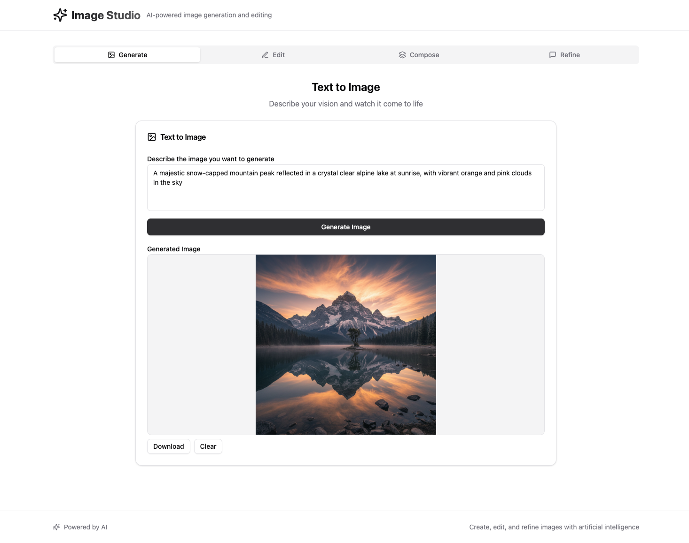
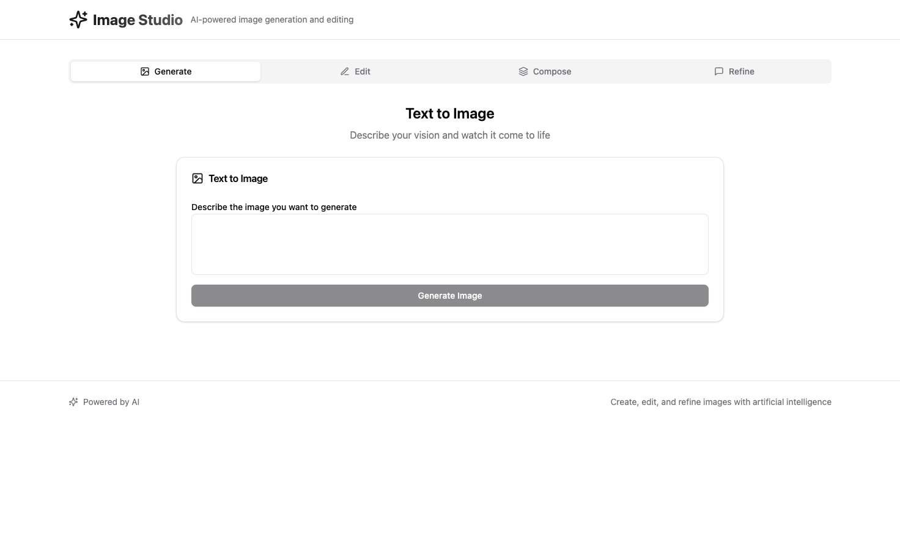
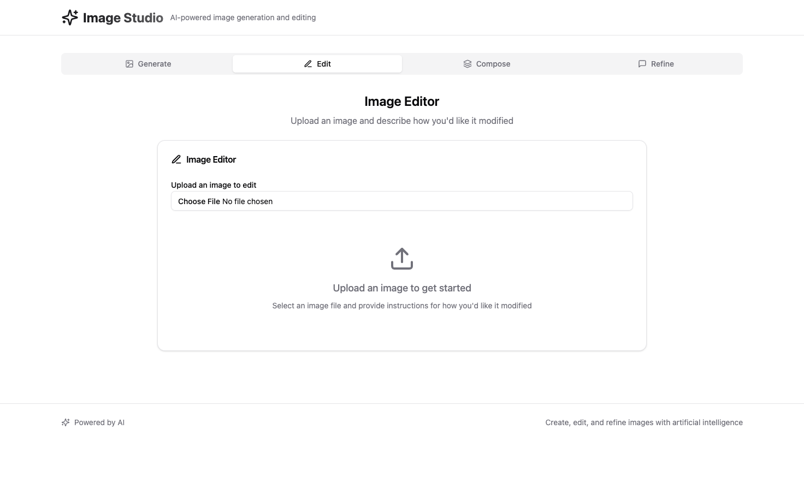
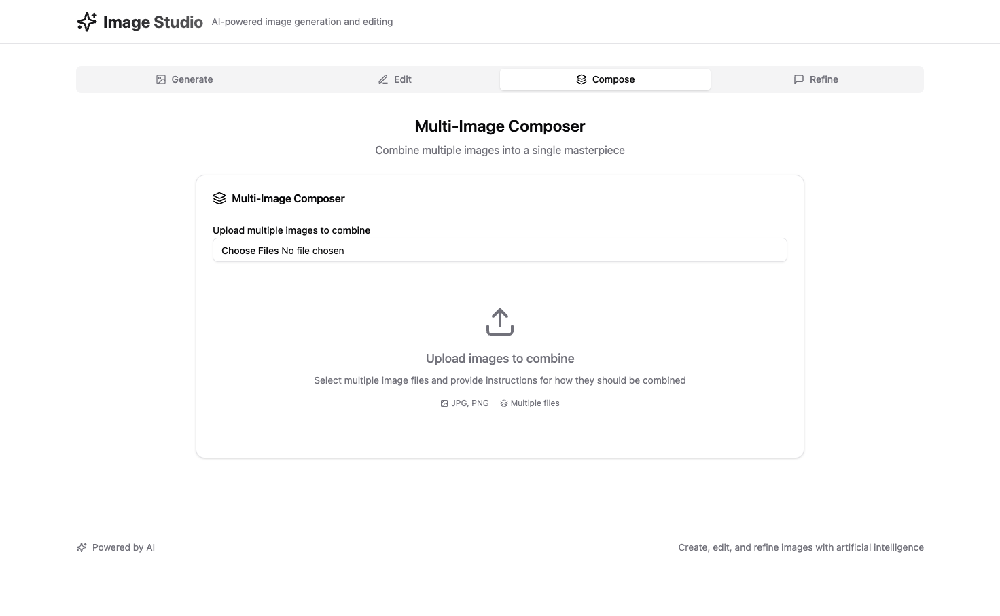
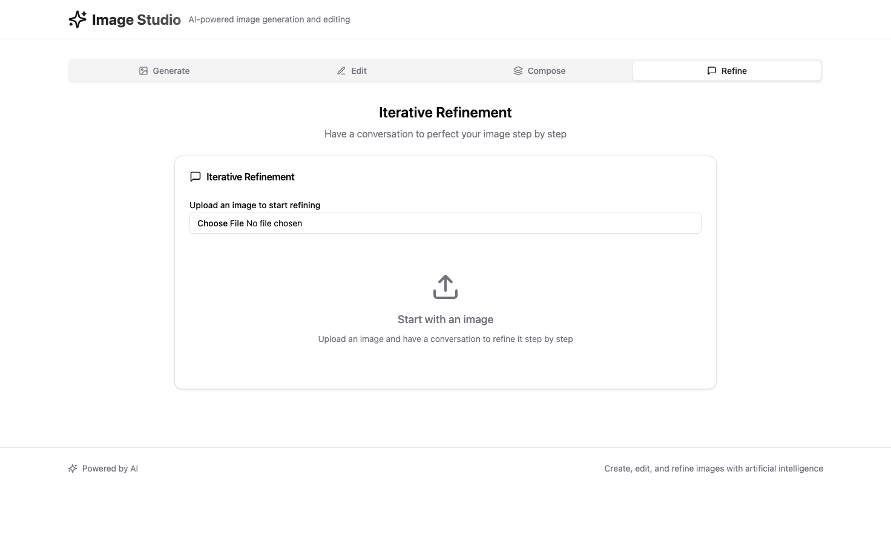

# 🎨 Image Studio - AI-Powered Image Generation

> Transform your imagination into reality with Google Gemini AI

[](https://bun.sh)
[](https://typescriptlang.org)
[](https://reactjs.org)
[](https://tailwindcss.com)
[](https://ai.google.dev)

A comprehensive image generation and editing suite powered by **Google Gemini 2.5 Flash Image Preview**. Create, edit, compose, and refine images through natural language conversations.



## ✨ Features

### 🖼️ **Text to Image Generation**
Transform your ideas into stunning visuals with simple text descriptions.



### ✏️ **Image Editing**
Upload any image and describe the changes you want - let AI do the rest.



### 🎭 **Multi-Image Composition**
Combine multiple images into artistic collages and compositions.



### 🔄 **Iterative Refinement**
Have a conversation with AI to perfect your images step by step.



## 🚀 Quick Start

### Prerequisites

- **Bun** (latest version) - [Install Bun](https://bun.sh/docs/installation)
- **Google AI API Key** - [Get your key](https://makersuite.google.com/app/apikey)

### Installation

1. **Clone the repository**
   ```bash
   git clone https://github.com/your-username/image-gemini.git
   cd image-gemini
   ```

2. **Install dependencies**
   ```bash
   bun install
   ```

3. **Set up environment variables**
   ```bash
   echo "GOOGLE_AI_API_KEY=your-google-ai-api-key-here" > .env
   ```

4. **Start the development servers**
   
   **Backend (Terminal 1):**
   ```bash
   bun run server
   ```
   
   **Frontend (Terminal 2):**
   ```bash
   bun run dev
   ```

5. **Open your browser**
   
   Navigate to `http://localhost:3000` and start creating!

## 🛠️ Tech Stack

### Core Technologies
- **Runtime**: Bun (JavaScript/TypeScript runtime)
- **Backend**: Bun.serve() with native HTTP handling
- **Frontend**: React 18 with TypeScript
- **Styling**: Tailwind CSS + shadcn/ui components
- **AI Engine**: Google Gemini 2.5 Flash Image Preview

### Development Tools
- **Testing**: Playwright (E2E testing)
- **Type Safety**: TypeScript with strict configuration
- **Code Quality**: ESLint + Prettier
- **Build Tool**: Bun (native bundling)

## 📁 Project Structure

```
image-gemini/
├── backend/
│   └── server.ts              # API server with Gemini integration
├── frontend/
│   ├── components/
│   │   ├── ui/               # shadcn/ui components
│   │   ├── ImageGenerator.tsx
│   │   ├── ImageEditor.tsx
│   │   ├── MultiImageComposer.tsx
│   │   └── IterativeRefinement.tsx
│   ├── lib/
│   │   └── utils.ts          # Utility functions
│   ├── App.tsx               # Main application
│   ├── index.tsx             # Frontend server
│   └── index.html            # HTML entry point
├── tests/                    # Playwright tests
├── package.json
├── tsconfig.json
└── README.md
```

## 🔌 API Endpoints

All endpoints support CORS and return JSON responses.

### **POST** `/api/text-to-image`
Generate images from text descriptions.

**Request:**
```json
{
  "prompt": "A serene mountain landscape at sunset"
}
```

**Response:**
```json
{
  "success": true,
  "imageUrl": "data:image/png;base64,...",
  "prompt": "A serene mountain landscape at sunset",
  "mimeType": "image/png"
}
```

### **POST** `/api/image-edit`
Edit existing images with natural language instructions.

**Request:** FormData
- `image`: File (image to edit)
- `instructions`: String (editing instructions)

**Response:**
```json
{
  "success": true,
  "imageUrl": "data:image/png;base64,...",
  "instructions": "Make the sky more dramatic",
  "mimeType": "image/png"
}
```

### **POST** `/api/multi-image`
Compose multiple images into one.

**Request:** FormData
- `images`: File[] (array of images)
- `instructions`: String (composition instructions)

**Response:**
```json
{
  "success": true,
  "imageUrl": "data:image/png;base64,...",
  "instructions": "Create a collage",
  "imageCount": 3,
  "mimeType": "image/png"
}
```

## 🎯 Usage Examples

### Text to Image
```
Prompt: "A cyberpunk cityscape at night with neon lights and flying cars"
Result: AI generates a futuristic city image
```

### Image Editing
```
Upload: photo.jpg
Instructions: "Add a rainbow in the sky and make the grass greener"
Result: Modified image with requested changes
```

### Multi-Image Composition
```
Upload: sunset.jpg, mountain.jpg, lake.jpg
Instructions: "Blend these into a panoramic landscape"
Result: Artistic composition of all three images
```

### Iterative Refinement
```
Upload: portrait.jpg
Chat: "Make the lighting more dramatic"
AI: [Returns modified image]
Chat: "Now add a subtle smile"
AI: [Returns further refined image]
```

## 🧪 Testing

Run the comprehensive test suite:

```bash
# Run all tests
bun test

# Run tests with UI
bun test:ui

# Run tests in headed mode (see browser)
bun test:headed
```

## 🔧 Available Scripts

```bash
# Development
bun run dev        # Start frontend (port 3000)
bun run server     # Start backend (port 3001)

# Production
bun run build      # Build for production
bun run start      # Start production server

# Testing
bun test          # Run Playwright tests
bun test:ui       # Interactive test runner
bun test:headed   # Visual test debugging
```

## 🌟 Key Features Explained

### **Responsive Design**
- Mobile-first approach
- Touch-friendly interfaces
- Adaptive layouts for all screen sizes

### **Real-time Processing**
- Live loading indicators
- Progress feedback
- Error handling with user-friendly messages

### **File Management**
- Drag & drop support
- Multiple file formats (JPG, PNG, WebP)
- Automatic file type detection

### **Download & Export**
- One-click downloads
- Proper file naming
- Base64 image handling

## 🚀 Deployment

### Environment Setup
1. Set `GOOGLE_AI_API_KEY` in your production environment
2. Build the project: `bun run build`
3. Start the production server: `bun run start`

### Docker Support (Optional)
```dockerfile
FROM oven/bun:latest
WORKDIR /app
COPY package.json bun.lockb ./
RUN bun install
COPY . .
EXPOSE 3000 3001
CMD ["bun", "run", "start"]
```

## 🤝 Contributing

1. Fork the repository
2. Create a feature branch: `git checkout -b feature/amazing-feature`
3. Make your changes and test thoroughly
4. Commit with conventional commits: `git commit -m 'feat: add amazing feature'`
5. Push to your branch: `git push origin feature/amazing-feature`
6. Open a Pull Request

## 📄 License

This project is licensed under the MIT License - see the [LICENSE](LICENSE) file for details.

## 🙏 Acknowledgments

- **Google Gemini AI** for the incredible image generation capabilities
- **shadcn/ui** for the beautiful, accessible UI components
- **Bun** for the lightning-fast runtime and tooling
- **Vercel** for design inspiration and best practices

---

<div align="center">

**Built with ❤️ by [Your Name](https://github.com/your-username)**

[🌟 Star this repo](https://github.com/your-username/image-gemini) • [🐛 Report Bug](https://github.com/your-username/image-gemini/issues) • [✨ Request Feature](https://github.com/your-username/image-gemini/issues)

</div>
